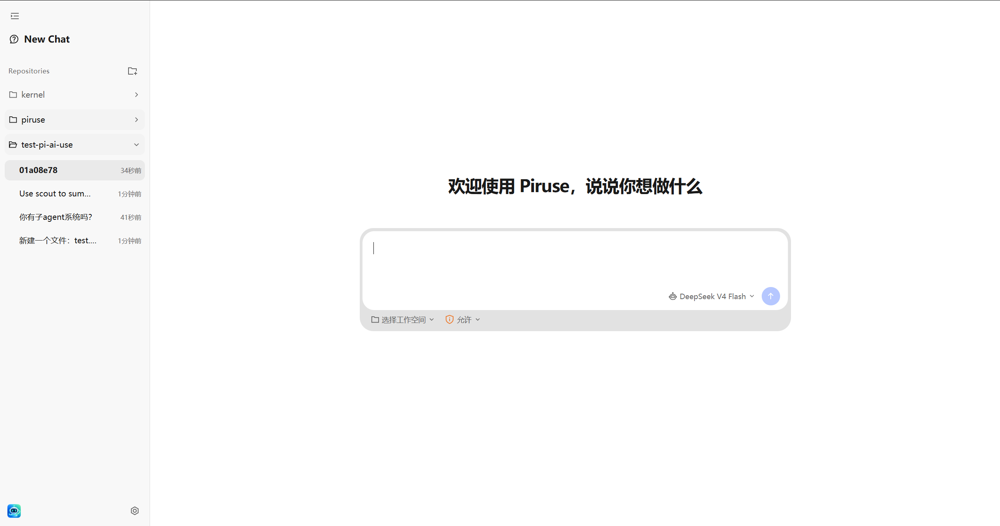
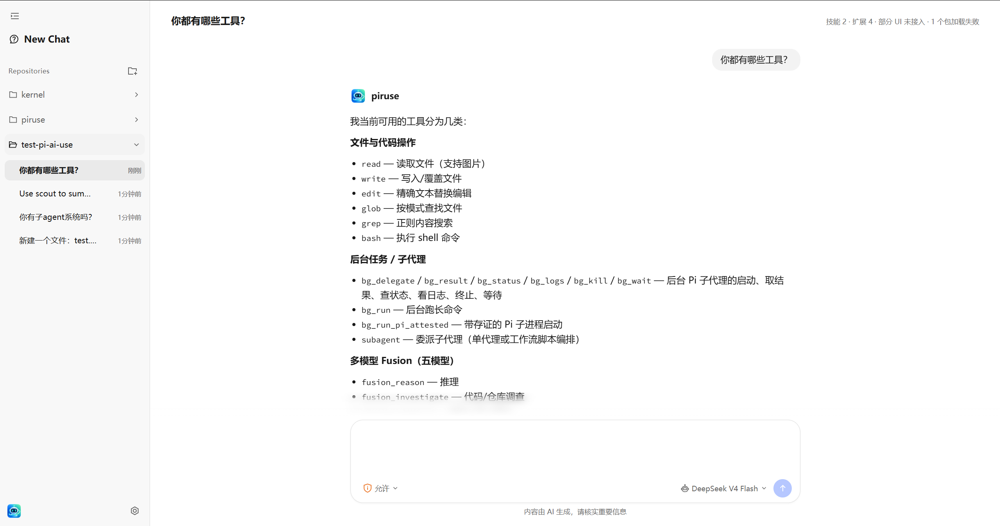
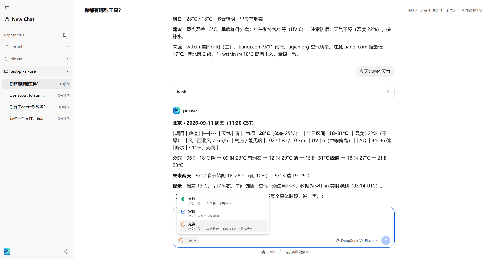
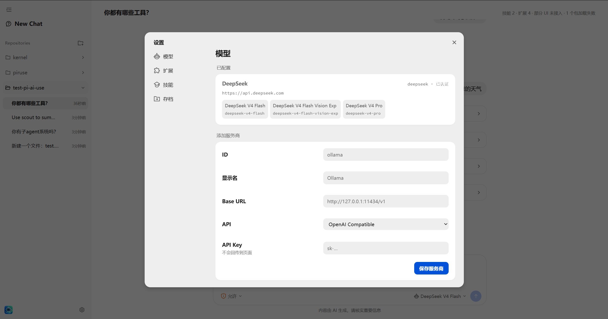
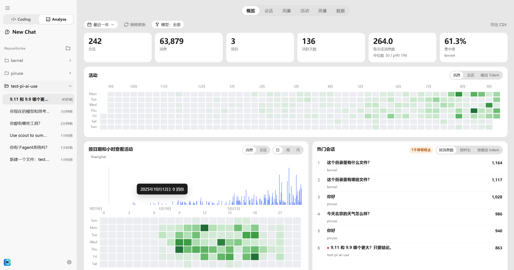
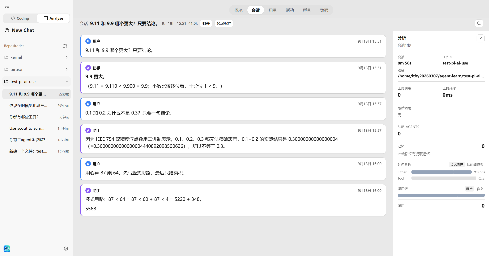
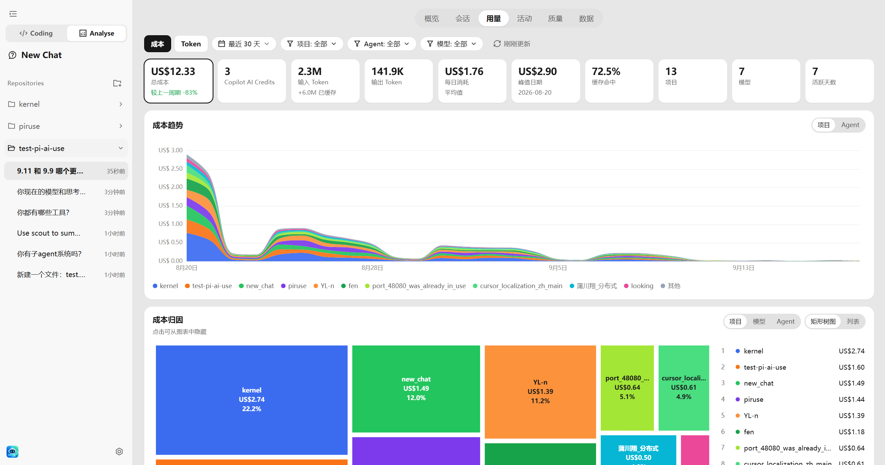
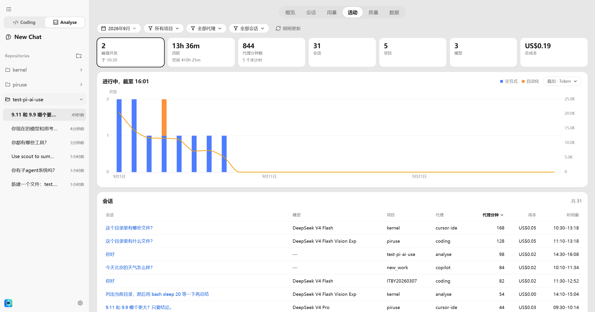
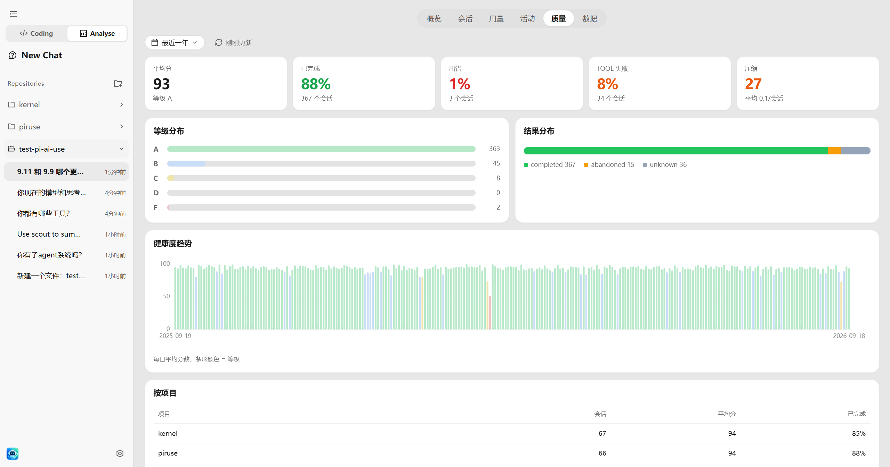

# piruse

本机 coding agent。对话、工具调用、会话和模型都跑在本机；浏览器只渲染界面，不接触 kernel 或模型密钥。

Agent 本体是 `packages/kernel`。Web / CLI 是调用方。模型目录和密钥与 [pi](https://github.com/badlogic/pi-mono) 共用 `~/.pi/agent`（`auth.json`、settings、已安装的扩展和技能）。会话写在 `~/.piruse/sessions`。

## Picture



















## 要不要装 pi

**不用。** 跑 piruse 不需要安装 [pi](https://github.com/badlogic/pi-mono) CLI，也不依赖 `@earendil-works/pi-coding-agent`。`npm install` 之后直接 `npm run web` / `npm start` 即可。

密钥、settings、已装扩展和技能读的是同一份 `~/.pi/agent`。你以前用过 pi，这些会直接生效；没用过也可以，自己写 `auth.json` 或设环境变量。

只有要装 / 卸扩展和技能时，才需要官方 `pi install` / `pi uninstall`。piruse 不做安装，只发现和启用。

## 要求

- Node.js ≥ 22.19
- 模型密钥可以后补：写在 `~/.pi/agent/auth.json`、设置对应 provider 的环境变量，或启动后在网页设置里填写

```bash
npm install
```

## 启动

本机窗口（默认 `http://127.0.0.1:8787`，只绑回环地址）：

```bash
npm run web
npm run web -- --cwd ~/code/other
npm run web -- --model deepseek/deepseek-v4-flash
```

命令行跑一轮后退出：

```bash
npm start -- "这个目录有哪些文件？"
npm start -- --continue
npm start -- --model deepseek/deepseek-v4-flash "…"
```

常用参数：`--cwd`、`--session`、`--continue` / `-c`、`--provider`、`--model`、`--permission read|review|allow`、`--port`、`--no-open`。

## 能做什么

- 读、搜、改文件：`read` / `grep` / `glob` / `write` / `edit` / `bash`
- 权限：只读、审核、允许。Web 默认审核，危险 bash 仍会拦住
- 多项目、多会话；归档后可在设置里恢复或删除
- 设置里管理模型、扩展、技能。安装 / 卸载扩展和技能仍用官方 `pi install` / `pi uninstall`，piruse 只负责发现和启用
- 已加载的 Pi 扩展可注册工具和 provider。TUI、slash 命令、快捷键在 Web 里不可用
- `pi-subagents` 的前台 `subagent` 由 piruse 自己的 harness 跑子会话，不包一层 Pi TUI

记忆模块（`memory/internal`、`memory/external`）还没接上。跨轮内容靠会话 jsonl；窗口太大时走 compaction。

## 还要改

整体循环已经能跑通，后面不会大动。

1. **技能、扩展、工具** 三大模块：现在能发现 / 加载 / 调用，但具体实现有问题，边界、启用方式和跟 kernel 的接法都不干净。
2. **文件布局**：kernel 已按 runtime 墙切开组装根；三大模块的实现还会再改。
3. **引入 pi-agent 的方案**：循环仍用 `AgentHarness`。`pi-agent-core` 只从 `runtime/` 进入，apps 只跟 `Operator` 说话。

## Analyse 看板：哪些数据接得上

Analyse 和 Coding 是同一套 kernel、同一份 `~/.piruse/sessions` jsonl。看板不另做埋点 SDK，也不读 Cursor / Copilot / 云端账单。浏览器只拿汇总快照（`loadAnalyse`），不直接读账本。

**jsonl 里有、已经接上：**

- 概览：会话数、消息、项目、活跃天、日历 / 小时热力、热门会话、Tool 调用次数
- 用量：input / output / cache token、费用（assistant `usage` 或 usage ledger）
- 活动：按会话起止时间推窗口、并发、费用
- 会话页：当前会话的 `ViewState`（消息和工具回合）
- 数据表：会话账本行
- 质量里能直接数的：中止、失败、工具错误、compaction 次数

**账本里没有、接不上：**

| 界面上的能力 | 为什么接不上 |
| --- | --- |
| 常用 Skills / 技能调用次数 | 技能只写入系统提示，模型用 `read` 打开 SKILL.md；jsonl 没有 skill 调用事件 |
| 质量 A–F、平均分 | 没有 LLM 评分或人工标注；现在的分数是用完成 / 中止 / 失败 / 工具错误推的操作健康度，不是回复质量 |
| 用量 credits / 账户余额 | 没有各 provider 的账单或额度接口 |
| 活动里的 automation | 没有后台自动化会话类型，全部记成 interactive |
| 按 Agent 拆分（Analyse vs Coding 等） | 只有 coding 会话；Analyse 是 UI 开关，不单独写 jsonl |
| Cursor / Copilot / 其他 IDE 用量 | 本机 agent 看不到那些产品的遥测 |
| MCP 工具 | `tools/mcp` 还没接 |
| 记忆读写 | `memory/` 还没接 |

时区按 Asia/Shanghai。归档会话不进看板。

## 结构

浏览器只看到 `packages/protocol`。UI 禁止 import kernel。Web / CLI 只调 `bootHarness` / `Operator`。

```
piruse/
  picture/                          # README 截图
  pisource/                         # 只读：学 API，不当产品目录
  packages/
    protocol/                       # 过线合同（ViewState / commands）
    kernel/                         # Agent 本体，见下
  apps/
    flags.ts                        # cli / web 共用 argv
    cli/                            # 命令行入口
    web/                            # 本机窗口：host + ui
    gateway/                        # 预留
    desktop/                        # 预留
  skills/                           # SKILL.md 内容，不是 TypeScript
```

### packages/kernel

循环仍在 pi 的 `AgentHarness`。kernel 把它藏在 `runtime/` 后面，其余目录按职责切开，避免再出现一个谁都往里塞的上帝对象。

```
packages/kernel/src/
  index.ts                 # 对外：bootHarness / Operator / projectView
  create-kernel.ts         # 组装根：boot 时接线
  assemble.ts              # loadWorkspace + bindSession（boot 和换会话共用）
  harness.ts               # Operator：prompt / 权限 / 订阅 / 换会话
  view.ts / messages.ts    # lane 快照 → ViewState
  hooks.ts                 # 权限门，不是扩展 hooks
  loop.ts / events.ts      # 空位：循环和通知仍走 runtime / hooks
  runtime/                 # 唯一可 import @earendil-works/pi-agent-core
    pi.ts                  # 再导出 pi 类型和工厂
    engine.ts              # 创建 env、jsonl repo、AgentHarness
    watch.ts               # lane 事件 → ViewState / CLI token
  session/                 # 打开、续写、列表、归档、Analyse 账本
  tools/
    builtin/               # 一工具一文件（read / write / edit / bash / grep / glob）
    policy.ts              # 只读 / 审核 / 允许
    mcp/                   # 预留
  models/                  # 目录、鉴权、~/.pi/agent/auth.json
  packages/                # 已装技能和扩展的清单、启用开关
  skills/                  # 从清单抽出技能，写入系统提示
  extensions/              # 加载已启用的扩展（工具、provider、子会话）
  prompt/ + context/       # 系统提示；本轮模型输入
  compaction/              # 窗口阈值（切点和摘要仍在 pi）
  profile/                 # 人设（现在只有 coding）
  memory/                  # 预留：internal / external
```

**为何这样切**

1. **墙在 runtime。** apps 和 kernel 其他目录都不直接碰 `pi-agent-core`。升级 pi、换调用方式只改这一层。循环不重写。
2. **组装和运行分开。** `create-kernel.ts` 在 boot 时把 models / session / skills / extensions / tools 拼好，交给 Operator。`assemble.ts` 给 boot 和换会话共用，避免接线抄两份。`harness.ts` 不再发现模块，只操作已经装上的东西。
3. **同级模块各改各的。** 换 jsonl 只动 `session/`，加工具只动 `tools/builtin/`，换默认模型只动 `models/`。技能、扩展、工具目录分开，是因为发现 / 加载 / 调用本来就不是一件事。
4. **`packages/` 不是第四个产品模块。** 技能和扩展共用 `~/.pi/agent` 里「装了什么、开没开」。清单放这里；`skills/` 只管注入提示，`extensions/` 只管加载工厂。以前揉在 `PackageHost` 里，改一处会碰到另外两处。
5. **空目录先占位。** `memory/`、`tools/mcp`、`loop.ts` 标明还没接，避免以后再从 Operator 里往外拆一次。

当前有代码：`runtime/` · `assemble.ts` · `session/` · `tools/builtin/` · `models/` · `prompt/` · `compaction/` · `profile/` · `extensions/` · `skills/` · `packages/`。只留位置：`memory/` · `tools/mcp`。三大模块的具体实现还会再改。
